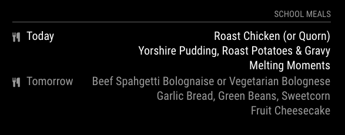

# MMM-repeating-schedule

This a 3rd party module for [MagicMirror](https://github.com/MichMich/MagicMirror) to display a regular or predictable schedule of events, without needing to create calendar events to be consumed by the built-in calendar module.

## Why?

I made this module so that I could display the regular repeating menu for my children's school dinners. Each week follows one of three menus, so I just have to list the start date for each rotation, and add a reference to an array containing the menu for that rotation.



Of course you can use it to display non-repeating or irregular events. I'm not judging.

## Installation

As with all modules, navigate to the `modules` directory of your Magic Mirror installation, and `git clone git@github.com:nimasmi/MMM-repeating-schedule.git`.

## Configuration

Add to the `modules` array in `config/config.js`:

``` javascript
modules: [
    {
        module: 'MMM-repeating-schedule',
        position: 'top_right',
        config: {
            headerText: 'Work lunches',
            dates: {
                '2016-09-12': ['sandwich', 'rice', 'beans', 'soup', 'pizza'],
                '2016-09-19': ['toast', 'omelette', 'leftovers*', 'wraps', 'hot pot'],
                '2016-09-26': ['fish', 'barbecue', 'potato', 'pie', 'curry'],
            }
        }
    },
]
```

Each entry in the array is mapped to a day corresponding to its array position, so the first array above, set to start on Monday 2016-09-12, has the value 'soup' for Thursday 15 September.

For schedules which repeat, you can define each array separately, and then reuse them:

``` javascript

var weekOne = ['sandwich', 'rice', 'beans', 'soup', 'pizza']
var weekTwo = ['toast', 'omelette', 'leftovers', 'wraps', 'hot pot']
var weekThree = ['fish', 'barbecue', 'potato', 'pie', 'curry']

modules: [
    {
        module: 'MMM-repeating-schedule',
        position: 'top_right',
        config: {
            headerText: 'School meals',
            dates: {
                '2016-09-12': weekOne,
                '2016-09-19': weekTwo,
                '2016-09-26': weekThree,
                '2016-10-03': weekOne,
                '2016-10-10': weekTwo,
                '2016-10-17': weekThree,
            }
        }
    },
]
```

## Configuration

The following properties can be set in config.js:


| **Option** | **Values** | **Description** |
| --- | --- | --- |
| `updateInterval` | Integer, default `1 * 60 * 60 * 1000` (1 hour) | Interval between updates, in seconds. |
| `headerText` | String, default: `""` | Text to show as a title. Title area is not displayed unless this is non-blank. | 
| `displaySymbol` | Boolean, default: `true` | Determines whether to show an icon for each entry. |
| `defaultSymbol` | String, default: `"cutlery"` | Fontawesome Symbol see http://fontawesome.io/cheatsheet/ |
| `startDay` | Integer, default: `0` (today) | Number of days ahead to start searching for the first entry |
| `maxResultLength` | Integer, default: `2` | Number of results to display |
| `maxDaysAhead` | Integer, default: `2` | Number of days ahead to stop searching |
| `maxWidth` | Integer, default: `null` | If set, determines the maximum with in pixels of the rendered table |
| `showBlankDays` | Boolean, default `false` | Determines whether to display a result for days on which no event can be found. If `true`, then such days count towards the result count, which will not exceed `maxResultLength`. |
| `blankDayText` | String, default: `""` (empty string) | Text to show for blank days if `showBlankDays` is `true` |

The number of results shown will be the minimum of `maxResultLength` and `maxDaysAhead + 1`.

\* Mmm, leftovers. Possibly my favourite meal.
